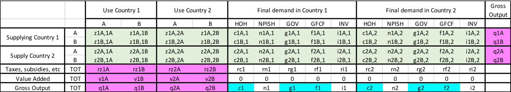

```{r load, include=F}
library(tidyverse)
theme_set(theme_bw())
library(knitr)
opts_chunk$set(echo = FALSE, comment=NA, fig.height=3)

#load(Deflate_tables.R)
#load(checks.R)

countries <- 
  readRDS(paste0("../outputs/wiot_", 2010, "_deflated.rds")) %>%
  filter(Country != "TOT") %>% 
  .$Country %>%
  unique()

GDP_WIOD <- readRDS("../outputs/GDP_WIOD.rds")
GDP_WB <- readRDS("../tmp/GDP_WB.rds")

```

This document presents the methodology used to deflate the input-output tables of the World Input-Output Database (WIOD), using the WIOD sectoral price deflators released in 2018. 

The WIOD database provides input-output tables for 43 countries, with 56 sectors, for the period from 2000 to 2014. These tables are in current price, and thus provide useful information on the economy at each year. However, in order to study the evolution over time of one indicator (e.g. greenhouse gas emissions), one must first disentangle price effects from volume effects. To isolate volume effects, all table must be converted to the same currency at the same year, in order to get tables at constant prices, through a procedure called “deflation”. This paper presents the deflation procedure used to deflated the WIOD tables released in 2016.

This methodology draws largely from the "Note on the Construction of WIOTs in Previous Year’s Prices", by @Los2014. 

All our sources and the corresponding R code are available at this url: [add link here].

After a presentation of the data used (section 1), we explain how we proceeded to deflated the input-output tables (section 2). This deflation process leads to residual errors, which are balanced in two steps (section 3). We conclude by checking the quality of our data (section 4).


# Overview of the data

The data sources used in this procedure are:

* the WIOD input-output tables released in 2016. The database provides input-output tables for 28 EU countries and 15 other major countries in the world for the period from 2000 to 2014. These tables are available in current price, in millions of dollars.
* the WIOD Socio-Economic Accounts, released in February 2018. In particular, they provide sectoral deflators for value added and GDP, in national currency. They are available at http://www.wiod.org/database/seas16.
* the WIOD exchange rates, used to transform value in national currencies to values in 2010 USD.
* the United Nations deflators for final demand, by economic activity, at current and constant prices (available at https://unstats.un.org/unsd/snaama/selbasicFast.asp). 

The WIOD input-output table is described in a simplified two-country example in Figure 1.



In WIOD, there are five categories of final demand for each country:
* Households (HOH)
* Non-profit institutions serving households (NPISH)
* Government spending (GOV)
* Global Fixed Capital Formation (GFCF)
* Investment (INV)

The row labelled "Taxes, subsidies, etc." in this stylized representation is actually made of six different rows in the data:

* taxes less subsidies on products (TXSP, row 66)
* Cif/ fob adjustments on exports (EXP_adj, row 67)
* Direct purchases abroad by residents (PURR, row 68)
* Purchases on the domestic territory by non-residents (PURNR, row 69) 
* Value added at basic prices (VA, row 70)
* International Transport Margins (IntTTM, row 71)

The colors correspond to the deflators available: for the cells in pink, deflators were obtained from the WIOD socio-economic accounts; for the blue cells, from the United Nations statistical division. The cells in green are deflated using the sectoral gross output deflators, and then balanced with the GRAS method (in section 3). 

# The deflation procedure

1. **Deflate value added and output**  
For the values in pink, deflators were obtained from the WIOD socio-economic accounts released in February 2018.
The WIOD actually provide sectoral deflators for value added and output. For the values related to the rows of "taxes, subsides, etc.", we assumed that industry-level deflators of value added apply, i.e.: prz1A = pv1A and prz1B = pv1B, where prz1A indicated the deflator of cell rz1A in our stylized table.
As the sectoral deflators from WIOD are expressed in national currency, while WIOD table are in USD, the deflation must also include variations of the exchange rate. 
To get the volume in constant 2010 USD, one must use the formula:
$$Vol^{2010 USD}_{t} = Val^{USD}_t \cdot \frac{E_{2010}}{E_t} \cdot \frac{\epsilon_{2010}}{\epsilon_t} $$
where $Vol^{2010 USD}_t$ is the GDP in volume at time $t$ measured in 2010 US dollars, $Val_t$ is the GDP in value (dollars) at time t, $E_t$ represents the national currency at time $t$ (e.g. euros), and $\epsilon_t$ is the exchange rate in dollars per unit of national currency at time $t$.


2. **Deflate final demand for households, governments and GFCF**  
The statistical division of the United Nations provides deflator for each category of final demand. However, @Los2014 found that deflators for NPISH and changes in inventories appeared “highly unreliable” when deflating the WIOD of the previous release (i.e. table up to 2009). We thus follow their strategy and use only the three deflators of household consumption, government spending and gross fixed capital formation. These deflators are used to deflate the sum of the corresponding consumptions (c1, g1, f1; c2, g2, f2).

3. **Deflate taxes and subsidies in final demands**  
Since no data is available, we assume that these deflators are equal to the GDP deflator of the using country, i.e. prc1 = prn1 = prg1 = pf1 = pri1 = pGDP1, and prc2 = prn2 = prg2 = pf2 = pri2 = pGDP2 (again, prc1 indicate the deflator in cell rc1 of our stylized example, prn1 the deflator in cell rn1, etc).

4. **Deflate final demand for NPISH and Inventories**  
The UN also provides deflators for NPISH and Inventories, but @Los2014 estimate these values to be unreliable. We follow the same procedure as them. First, we deflate the cells by supposing that the deflators are equal to gross output deflators of the supplying country, i.e. pn1A,1 = pi1A,1 = pn1A,2 = pi1A,2 = pq1A.
By summing the columns, we then get a deflated value for NPISH and inventories final demand.

5. **Deflate intermediate consumptions**  
We deflate intermediate consumptions using gross output deflators, e.g. pz1A,1A = pz1A,1B = pq1A.

6. **Deflate cells of final demand for Households, government and GFCF**
We deflate the cells using gross output deflators, e.g. pc1A,1 = pg1A,1 = pi1A,1 = pq1A.

# Balancing the matrix

## Balancing valued added and final demand
In theory, total deflated value added should be equal to total deflated final demand (including exports) minus imports: this is simply the result of the accounting equality between ressources and uses : 

$$\sum (\text{value added + taxes - subsidies + imports}) = \sum \text{final demands}$$

However, as our various sources of deflators may not be entirely consistent, some unbalance may appear between total value added and total final demand. 
We distribute this unbalance to inventories, in proportion of the size of each inventory.

If we denote $\delta$ the difference between total value added and total final demand, and $Inv\_Tot_0$ the sum of inventories of all countries before adjustment, then each cell of inventory is adjusted with a coefficient $k = (1 + \frac{\delta}{Inv\_Tot_0})$. 
If we denote with a wide tilde the adjusted value, so that $\widetilde{i1A,1}$ represents the adjusted value of the inventory cell iA1,1 in our stylized table, we have:
$$
\begin{align}
\widetilde{i1A,1} = k \cdot i1A,1 \\
\widetilde{i1B,1} = k \cdot i1B,1 \\
\widetilde{i1A,2} = k \cdot i1A,2 \\
\widetilde{i1B,2} = k \cdot i1B,2 
\end{align}
$$ 
We check that this adjustment is does not impact inventory levels too much in section 4.4.

## Applying the GRAS procedure

We now apply the Generalized-RAS (or GRAS) procedure to balance the matrix. This procedure is well documented and commonly used for balancing input-output tables (see @Miller2009). 

The GRAS method is used when the exact row sum and the column sum of a matrix are known, while there is uncertainty on the exact value of the cells in the matrix (so that the colum sums  and row sums of the matrix cells is not exactly equal to what is know to be the exact sums).  The algorithm converges through an iterative process of scaling cells, to match the observed row and column sums with their known values.

Several versions of the GRAS procedure co-exist in the literature (@Junius2003, @Lenzen2007, @Temurshoev2013). Here, we use the one described in @Temurshoev2013. The advantage of this procedure over the ones of @Junius2003 and @Lenzen2007 is that it works even if one row or column does not include any positive element - which may occur in an input-output table, for example in the inventory column.

We build an implementation of this procedure with the programming language R, which can be reused independently of the rest of the code used for deflation.

Following @Los2014, we balance simultaneously the entire WIOD with all countries. We apply the GRAS procedure to cells in green in our stylized example, i.e. intermediate consumptions plus final demands. We balance these cells to have a consistent matrix, to reconciliated the row sum with the valued added and gross output deflated using WIOD data. 

The row sum in GRAS is thus the gross output of each sector and country; the column sum is equal to gross output, minus value added, imports, Taxes and subsidies, etc. Note that this procedure ensure equality *at the global level* between value added plus taxes on the one hand, and final demand minus imports on the other; but this equality will not necessarily hold for each country with this procedure. However, the deviation remains small: 1,15% in the word case (see section 4.3).  


# Checking results quality

## Quality of initial data: GDP before deflation

We compare the GDP at current prices (in USD) from WIOD and World bank for six European countries in the figure below. Then we show the difference for all countries, in order to identify any major divergence.
```{r current prices: World bank vs WIOD}
bind_rows(GDP_WB,
          GDP_WIOD) %>% 
  filter(unit == "current USD") %>% 
  filter(country %in% c("FRA", "DEU", "GBR", "ESP", "ITA", "NLD")) %>% 
  ggplot(aes(x = year, y = value, colour = source, linetype = source)) + 
  geom_line() +
  labs(y = "current USD (billions)",
       title = "GDP at current prices", 
       x = "") +
  facet_grid(country ~., scales="free") 
```

```{r table of deflation error (current prices), warning=TRUE}
deflation_error <- 
  bind_rows(GDP_WB,
          GDP_WIOD) %>% 
  filter(unit == "current USD") %>% 
  filter(country %in% countries) %>% 
  spread(key = source, value = value) %>% 
  mutate(diff = round(100 * ((WIOD / `World Bank`) - 1),2)) %>% 
  select(year, country, diff) 
deflation_error %>% 
  ggplot(aes(x = year, y = diff, colour = country)) +
  geom_line() +
  theme(legend.position = "none") +
  labs(title = "GDP difference between WIOD and World bank, in percent \n (GDP at current prices)")
  geom_text(aes(label = ifelse(year == 2012, country, ""))) 
  
```

## GDP after deflation
```{r constant prices, World bank vs WIOD}
bind_rows(GDP_WB,
          GDP_WIOD) %>% 
  filter(unit == "2010 USD") %>% 
  filter(country %in% c("FRA", "DEU", "ESP", "ITA", "GBR", "NLD")) %>% 
  ggplot(aes(x = year, y = value, colour = source, linetype = source)) + 
  geom_line() +
  labs(y = "constant 2010 USD (billions)", 
       title = "GDP at constant prices", 
       x = "") +
  facet_grid(country ~., scales="free") 
```

```{r table of deflation error, warning=TRUE}
deflation_error <- 
  bind_rows(GDP_WB,
          GDP_WIOD) %>% 
  filter(unit == "2010 USD") %>% 
  filter(country %in% countries) %>% 
  spread(key = source, value = value) %>% 
  mutate(diff = round(100 * ((WIOD / `World Bank`) - 1),2)) %>% 
  select(year, country, diff) %>% 
  spread(key = year, value = diff)

#Find countries with NA:
#deflation_error$country[which(is.na(deflation_error$`2008`))]
#The World Bank does not have data for Taiwan (TWN) and the Rest of the World (ROW)
#So we remove them from our kable

deflation_error %>% 
  filter(!(country %in% c("TWN", "ROW"))) %>% 
  kable(caption = "WIOD GDP after deflation relative to World Bank data (difference in percentage)", align='lcc')
```

If we look at the annual error for each country, we see that Australia (AUS), Turkey (TUR), Japan (JPN) and India (IND) are the only countries for which the constant GDP notably departs from World Bank estimates.
```{r plot of annual error, warning=FALSE}
p <- deflation_error %>% 
  gather(key = year, value = value, -country) %>% 
  mutate(year = as.integer(year)) %>% 
  ggplot(aes(x = year, y = value, colour = country)) +
    geom_line() +
    theme(legend.position = "none") +
  labs(x = "", y = "Percentage", title = "Deflated GDP, difference between WIOD and World Bank")
p + geom_text(aes(label = ifelse(year == 2014, country, "")))

# library(plotly)
# ggplotly(p)
```

These discrepancy seem largely driven by the original data in current prices. The difference in 2010 is particularly structuring, as shown in the figure below.
```{r current prices: Discrepancy for 4 countries, fig.height=2, fig.width=6}
deflation_error_current <- 
  bind_rows(GDP_WB,
          GDP_WIOD) %>% 
  filter(str_detect(unit, "USD")) %>% 
  filter(country %in% c("AUS", "IND", "JPN", "TUR", "RUS")) %>% 
  spread(key = source, value = value) %>% 
  mutate(diff = round(100 * ((WIOD / `World Bank`) - 1),2)) %>% 
  select(year, country, unit, diff)

deflation_error_current %>% 
  ggplot(aes(x = year, y = diff, colour = unit)) +
  geom_line() +
  facet_grid(. ~ country)
```


## Value added vs final demand

The deflation procedure used does not ensure that value added (inclusive of taxes and subsidies) is equal to final demand minus imports for each country. We test the difference for each country, in percentage, defined as follow:
$$Diff = \frac{ \sum_i (FD_i - M_i) - \sum_j VA_j } {\sum_j FD_j}$$

The maximum difference of all countries for each year is given in the following table. 

```{r final demand vs VA, echo=F}

country_error <- readRDS("../outputs/diff_VA_FD.rds") %>%
  filter(country != "TOT") %>%
  mutate(diff = round(diff, 2)) %>%
  spread(key = year, value = diff)

max_error <-
  readRDS("../outputs/diff_VA_FD.rds") %>%
  filter(country != "TOT")  %>%
  group_by(year) %>%
  summarise(max = max(diff), min = min(diff), max.abs = max(abs(diff))) %>%
  gather(key = indicator, value = value, -year) %>%
  mutate(value = round(value, 2)) %>%
  spread(key = year, value = value) %>%
  mutate(indicator = as.factor(indicator)) %>%
  mutate(indicator = factor(indicator, levels = c("max", "min", "max.abs"))) %>%
  arrange(indicator)

kable(max_error, caption = "Error between value added and final demand, in %",
      align='lcccccccc')
```

## Inventory adjustment

When balancing the matrix, the first step was to attribute to inventories the differential between GDP measured through production (with value added) and GDP measured through expenses (with final demand minus imports).

We measure the magnitude of the adjustment, to check that the impact on inventories is not disproportionately high. These results are indicated in the following table.

```{r}
inventories <- 
  readRDS("../outputs/inventory_adjustment_all.rds") %>% 
  select(c(1,3)) %>% 
  mutate(inventory_change_rate = paste0(100*round(inventory_change_rate, 2), "%")) %>% 
    rename(`Inventory change rate` = inventory_change_rate, Year = year) 

kable(inventories, caption = "Inventory change rate, in %",
      align='lcc')
```

## Comparison of current and constant prices

Such a comparison allows to check whether GDP at current and constant prices are equal in 2010. It also shows the implicit deflators used.

```{r current vs constant, fig.height=2, fig.width=6}
plotCurrentvsConstant <- function(selected_country) {
    #' country as country code (ex: "FRA"
    readRDS("../outputs/GDP_WIOD.rds") %>%  
    filter(unit %in% c("2010 USD", "current USD"),
           country == selected_country) %>% 
    ggplot(aes(x = year, y = value, colour = unit)) + 
    geom_line() +
    labs(x = "", y = "billion USD", title = paste0(selected_country, ", Current vs constant GDP, in USD"))
}

plotCurrentvsConstant("FRA")
```


# References


